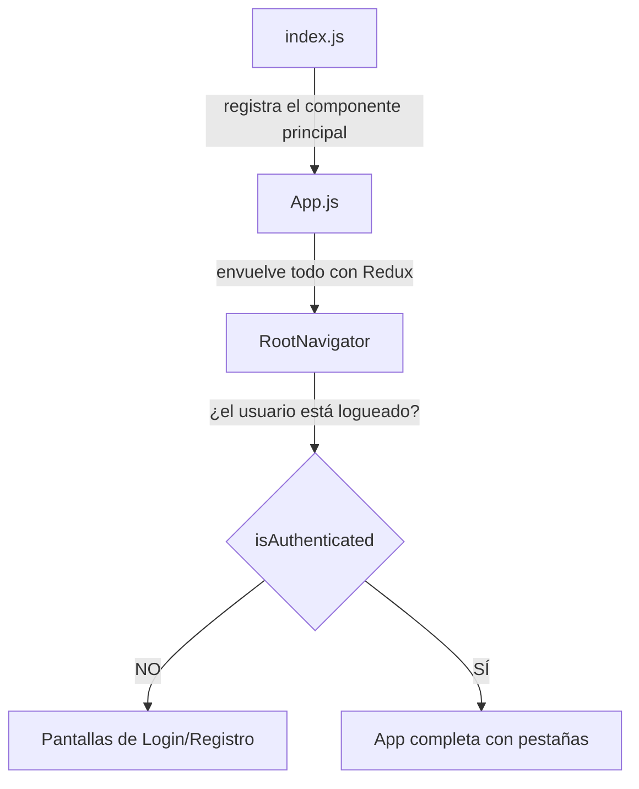
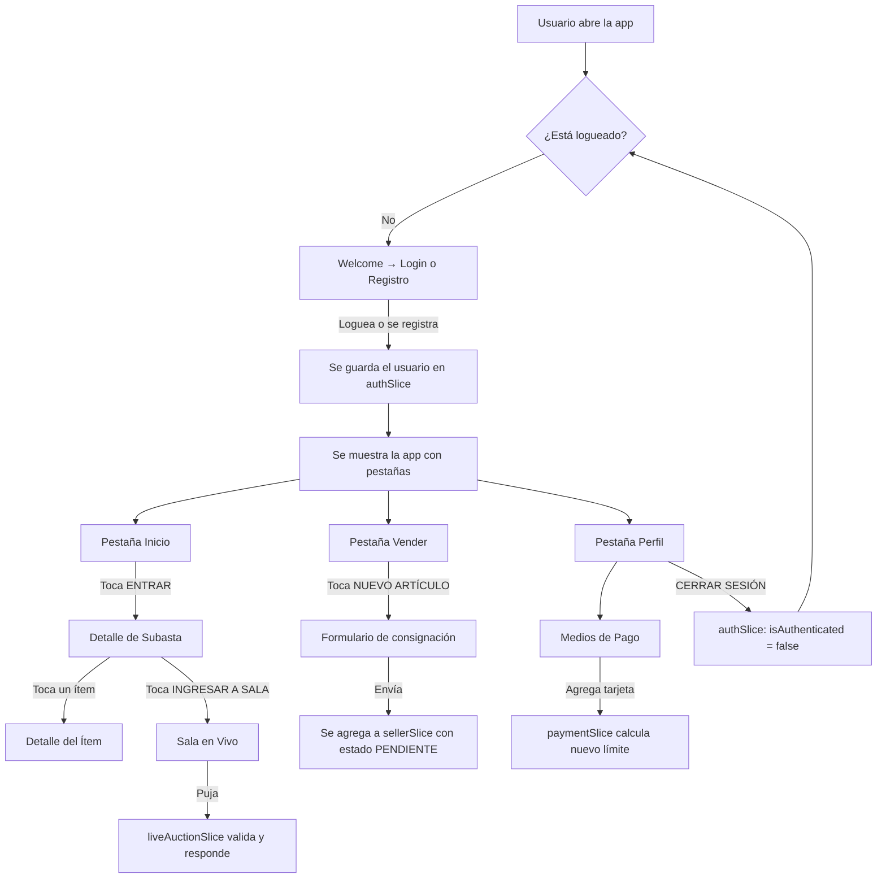

# Documentación del Proyecto SubastApp

> Guía para la exposición oral. Todo explicado de la forma más simple posible.

---

## ¿Qué es esta app?

Es una app de **subastas** hecha con React Native y Expo. Permite:

- Registrarse e iniciar sesión
- Ver un catálogo de subastas
- Entrar a una sala de subasta en vivo y pujar
- Proponer artículos para vender (consignación)
- Agregar tarjetas de pago que definen cuánto podés pujar
- Ver estadísticas de tu actividad

> [!IMPORTANT]
> No hay un servidor real. Todos los datos son inventados y viven dentro de la app. Cuando cerrás la app, se reinician. Esto es a propósito: el foco del TPO es la interfaz y la lógica del lado del cliente.

---

## Tecnologías

| Qué | Para qué |
|---|---|
| **Expo / React Native** | Crear la app móvil con JavaScript |
| **React Navigation** | Moverse entre pantallas (como las flechas "atrás" y las pestañas de abajo) |
| **Redux Toolkit** | Guardar datos que se comparten entre varias pantallas (ej: el usuario logueado) |
| **expo-image-picker** | Abrir la cámara del celular para sacar fotos |

---

## Estructura de carpetas

```
subastas-app/
├── App.js              ← Arranca todo: navegación y conexión con Redux
├── index.js            ← Le dice a Expo cuál es el componente principal
├── app.json            ← Configuración de Expo (nombre, ícono, splash)
├── package.json        ← Lista de librerías que usa el proyecto
└── src/
    ├── store/           ← Acá se guardan los datos globales de la app
    │   ├── index.js
    │   └── slices/      ← Cada archivo maneja un grupo de datos
    │       ├── authSlice.js
    │       ├── auctionsSlice.js
    │       ├── liveAuctionSlice.js
    │       ├── sellerSlice.js
    │       └── paymentSlice.js
    ├── utils/
    │   └── category.js  ← Función que compara categorías de usuarios
    └── screens/         ← Cada archivo es una pantalla de la app
        ├── CatalogScreen.js
        ├── AuctionDetailScreen.js
        ├── ItemDetailScreen.js
        ├── LiveAuctionRoomScreen.js
        ├── auth/          ← Pantallas de login y registro
        ├── seller/        ← Pantallas del vendedor
        └── profile/       ← Pantallas de perfil, pagos, estadísticas
```

---

## Cómo arranca la app



1. **index.js** le dice a Expo: "el componente principal es `App`".
2. **App.js** hace dos cosas:
   - Envuelve toda la app con `Provider` para que todas las pantallas puedan leer y modificar los datos globales (Redux).
   - Dentro pone `RootNavigator`, que mira si el usuario está logueado o no.
3. Si **no está logueado** → muestra las pantallas de bienvenida, login y registro.
4. Si **está logueado** → muestra la app completa con las 4 pestañas de abajo.

---

## Las 4 pestañas de abajo

Cuando el usuario está logueado, ve una barra de pestañas con 4 opciones:

| Pestaña | Ícono | Qué muestra |
|---|---|---|
| **Inicio** | 🏠 | Catálogo de subastas disponibles |
| **Subasta** | 🔨 | Pantalla vacía (no implementada) |
| **Vender** | ➕ | Panel del vendedor con sus artículos |
| **Perfil** | 👤 | Perfil, pagos, estadísticas, artículos |

La pestaña activa se pinta de amarillo.

---

## Datos globales (Redux Store)

La app guarda 5 grupos de datos que **cualquier pantalla puede leer o modificar**:

### 1. `auth` — Datos del usuario logueado

**Archivo:** [authSlice.js](file:///c:/Users/buizf/subastas-app-TPO_DESARROLLO_APPS_1/src/store/slices/authSlice.js)

Guarda si el usuario está logueado y quién es.

**Datos que tiene:**
- `isAuthenticated` → `true` o `false`. Es lo que decide si mostrás el login o la app.
- `user` → nombre, email, categoría (COMUN, PLATA, etc.) y si tiene métodos de pago verificados.

**Acciones (cosas que podés hacer):**
- `loginSuccess(datos)` → Marca al usuario como logueado y guarda sus datos. Se usa en la pantalla de Login.
- `logout()` → Desloguea al usuario. Se usa en el botón "Cerrar Sesión" del Perfil.
- `simulateApproval()` → Simula que el servidor aprobó el registro. Crea un usuario falso con categoría COMUN. Se usa al terminar el registro.

---

### 2. `auctions` — Lista de subastas

**Archivo:** [auctionsSlice.js](file:///c:/Users/buizf/subastas-app-TPO_DESARROLLO_APPS_1/src/store/slices/auctionsSlice.js)

Tiene una lista fija de 3 subastas inventadas:

| Subasta | Moneda | Categoría mínima | Ítem que se subasta |
|---|---|---|---|
| Colección Motors | USD | PLATA | BMW M3 ($85,000) |
| Terrenos Sur | ARS | PLATINO | Lote 500m² ($15M) |
| Relojes de Lujo | USD | COMUN | Rolex Submariner ($12,000) |

**Acciones:**
- `selectAuction(id)` → Cuando tocás "ENTRAR" en una subasta, guarda cuál elegiste para que la siguiente pantalla sepa qué mostrar.
- `clearSelectedAuction()` → Borra la selección (no se usa actualmente).

---

### 3. `liveAuction` — Sala de subasta en vivo

**Archivo:** [liveAuctionSlice.js](file:///c:/Users/buizf/subastas-app-TPO_DESARROLLO_APPS_1/src/store/slices/liveAuctionSlice.js)

Maneja lo que pasa dentro de la sala de subasta: quién pujó, cuánto, y si tu puja fue aceptada.

**Datos que tiene:**
- `currentItem` → El ítem que se está subastando (nombre y precio base)
- `currentHighestBid` → La oferta más alta hasta ahora (arranca en $90,000)
- `highestBidder` → Quién hizo esa oferta
- `status` → En qué estado está la puja: `idle` (esperando), `bidding` (procesando), `success` (aceptada), `error` (rechazada)

**Acciones:**
- `placeBid(monto)` → Envía tu puja. Espera 1 segundo (simula que habla con un servidor) y valida:
  - La puja tiene que ser al menos 1% del precio base más alta que la oferta actual.
  - No puede ser más de 20% del precio base por encima de la oferta actual (salvo usuarios ORO o PLATINO).
- `receiveNewBid({ amount, bidder })` → Simula que otro usuario pujó. Se activa automáticamente cada 5 segundos con probabilidad aleatoria.
- `resetStatus()` → Vuelve el estado a "esperando" después de un error.

---

### 4. `seller` — Artículos del vendedor

**Archivo:** [sellerSlice.js](file:///c:/Users/buizf/subastas-app-TPO_DESARROLLO_APPS_1/src/store/slices/sellerSlice.js)

Tiene una lista de artículos que el vendedor propuso para subastar. Vienen 3 de ejemplo:

| Artículo | Estado |
|---|---|
| Sillón Luis XV | ✅ ACEPTADO (precio base $1,200 USD, con seguro) |
| Juego de Té | ❌ RECHAZADO (motivo: piezas incompletas) |
| Reloj de Bolsillo | ⏳ PENDIENTE (en evaluación) |

**Acciones:**
- `addConsignment(datos)` → Agrega un artículo nuevo con estado PENDIENTE. Se usa cuando el vendedor llena el formulario.

---

### 5. `payment` — Métodos de pago

**Archivo:** [paymentSlice.js](file:///c:/Users/buizf/subastas-app-TPO_DESARROLLO_APPS_1/src/store/slices/paymentSlice.js)

Guarda las tarjetas del usuario y calcula su **límite de puja** (cuánto puede ofertar como máximo).

**Regla simple:**
- Tarjeta **internacional** → da $50,000 de límite
- Tarjeta **nacional** → da $5,000 de límite
- El límite total es la **suma de todas las tarjetas**

**Acciones:**
- `addPaymentMethod(datos)` → Agrega una tarjeta, le asigna un límite según si es internacional o no, y recalcula el total.
- `removePaymentMethod(id)` → Elimina una tarjeta y recalcula el total.

---

## Utilidad: Categorías

**Archivo:** [category.js](file:///c:/Users/buizf/subastas-app-TPO_DESARROLLO_APPS_1/src/utils/category.js)

Las categorías tienen un orden de jerarquía:

```
COMUN < ESPECIAL < PLATA < ORO < PLATINO
```

**Regla:** Para poder **pujar** en una subasta, tu categoría tiene que ser igual o superior a la de la subasta. Ejemplo: si la subasta es PLATA, solo pueden pujar usuarios PLATA, ORO o PLATINO. Los COMUN y ESPECIAL pueden **ver** la sala pero no pujar.

Tiene dos funciones:
- `getCategoryRank(cat)` → Devuelve un número (COMUN=0, ESPECIAL=1, PLATA=2, ORO=3, PLATINO=4).
- `canEnterAuction(userCat, auctionCat)` → Compara los dos números y dice si el usuario puede pujar o no.

---

## Pantallas de Login y Registro

### [WelcomeScreen.js](file:///c:/Users/buizf/subastas-app-TPO_DESARROLLO_APPS_1/src/screens/auth/WelcomeScreen.js)

La primera pantalla que ve el usuario. Muestra el nombre de la app y dos botones: "INICIAR SESIÓN" y "REGISTRARME". Solo navega a otras pantallas, no hace nada con datos.

---

### [LoginScreen.js](file:///c:/Users/buizf/subastas-app-TPO_DESARROLLO_APPS_1/src/screens/auth/LoginScreen.js)

Formulario de email y contraseña. Cuando tocás "INGRESAR":
1. Si algún campo está vacío → muestra un cartel de error.
2. Si ambos tienen texto → loguea al usuario con datos inventados (nombre "Usuario Logueado", categoría COMUN).

No hay validación real. Cualquier email y contraseña funcionan.

---

### [RegisterStep1Screen.js](file:///c:/Users/buizf/subastas-app-TPO_DESARROLLO_APPS_1/src/screens/auth/RegisterStep1Screen.js)

Formulario de registro. Pide:
- Nombres, Apellidos, Domicilio Legal, País
- Foto del DNI frente (abre la cámara)
- Foto del DNI dorso (abre la cámara)

Cuando tocás "ENVIAR A VERIFICACIÓN":
1. Verifica que los 4 campos estén completos.
2. Verifica que las 2 fotos estén tomadas.
3. Muestra un cartel diciendo que los datos serán verificados.
4. Al tocar "ENTENDIDO" pasa al paso 2.

---

### [RegisterStep2Screen.js](file:///c:/Users/buizf/subastas-app-TPO_DESARROLLO_APPS_1/src/screens/auth/RegisterStep2Screen.js)

Simula que el usuario recibió un email diciendo que su cuenta fue aprobada. Le pide crear una contraseña.

Cuando tocás "FINALIZAR REGISTRO":
1. Verifica que las dos contraseñas coincidan.
2. Crea un usuario falso con categoría COMUN y lo marca como logueado.
3. La app pasa automáticamente a la pantalla principal.

---

## Pantallas de Catálogo y Subastas

### [CatalogScreen.js](file:///c:/Users/buizf/subastas-app-TPO_DESARROLLO_APPS_1/src/screens/CatalogScreen.js)

Es la pantalla de **Inicio**. Muestra una lista de subastas activas como tarjetas.

Cada tarjeta muestra: imagen, título, moneda (USD o ARS), categoría mínima y fecha de cierre.

Cuando tocás **"ENTRAR"** en una tarjeta:
1. Guarda en Redux cuál subasta elegiste.
2. Te lleva a la pantalla de detalle de esa subasta.

---

### [AuctionDetailScreen.js](file:///c:/Users/buizf/subastas-app-TPO_DESARROLLO_APPS_1/src/screens/AuctionDetailScreen.js)

Muestra el detalle de la subasta que elegiste: imagen grande, título, categoría, moneda, hora de cierre, y la lista de ítems que se subastan.

- Si tocás un **ítem** → vas al detalle de ese ítem.
- Si tocás **"INGRESAR A SALA DE SUBASTA"** → vas a la sala en vivo.

Lee la subasta seleccionada de Redux (`state.auctions.selectedAuction`).

---

### [ItemDetailScreen.js](file:///c:/Users/buizf/subastas-app-TPO_DESARROLLO_APPS_1/src/screens/ItemDetailScreen.js)

Muestra todo sobre un ítem: imágenes (se pueden deslizar), descripción, artista/diseñador, precio base, historia y propietario actual.

Recibe el `itemId` de la pantalla anterior y busca el ítem dentro de la subasta seleccionada.

---

### [LiveAuctionRoomScreen.js](file:///c:/Users/buizf/subastas-app-TPO_DESARROLLO_APPS_1/src/screens/LiveAuctionRoomScreen.js)

Es la pantalla más compleja. Simula una sala de subasta en vivo.

**Lo que muestra:**
- Arriba: botón de cerrar, título "Sala EN VIVO", indicador rojo "LIVE"
- Un rectángulo negro que simula ser un video en vivo (no tiene video real)
- El nombre del ítem y su precio base
- La oferta más alta actual y quién la hizo (en números grandes)
- Un campo para escribir tu puja y un botón "PUJAR AHORA"
- Dos botones rápidos: "PUJA MÍNIMA" y "+5% Base"

**Lo que pasa por detrás:**
- Cada 5 segundos, hay un 30% de chance de que un "usuario falso" haga una puja. Esto simula que hay otras personas pujando en la sala.
- Cuando pujás, el botón muestra un spinner durante 1 segundo (simula la comunicación con el servidor) y después te dice si fue aceptada o rechazada.
- Si tu categoría es inferior a la de la subasta, ves un cartel amarillo diciendo "Sólo observador" y los botones de puja se deshabilitan.

**Reglas de puja:**
- El incremento mínimo es 1% del precio base. Si el precio base es $85,000, la puja tiene que ser al menos $850 más alta que la oferta actual.
- No podés pujar más de 20% del precio base por encima de la oferta actual (excepto usuarios ORO y PLATINO, que no tienen ese tope).

---

## Pantallas del Vendedor

### [SellerDashboardScreen.js](file:///c:/Users/buizf/subastas-app-TPO_DESARROLLO_APPS_1/src/screens/seller/SellerDashboardScreen.js)

Panel del vendedor. Muestra la lista de artículos que propuso para subastar, cada uno con un badge de color:
- 🟢 Verde = ACEPTADO
- 🔴 Rojo = RECHAZADO
- 🟠 Naranja = PENDIENTE

Tiene un botón amarillo "NUEVO ARTÍCULO" para proponer uno nuevo.

Si tocás un artículo, vas a ver su detalle.

---

### [NewConsignmentScreen.js](file:///c:/Users/buizf/subastas-app-TPO_DESARROLLO_APPS_1/src/screens/seller/NewConsignmentScreen.js)

Formulario para proponer un artículo nuevo. Pide:
- Título del artículo
- Historia y detalles (campo de texto largo)
- 6 fotos del artículo (obligatorias, se toman con la cámara)
- Dos declaraciones juradas que tenés que aceptar:
  1. Que el artículo es tuyo y no tiene problemas legales
  2. Que el origen del artículo es lícito

Cuando tocás "ENVIAR SOLICITUD", valida todo y agrega el artículo a la lista con estado PENDIENTE.

---

### [ConsignmentDetailScreen.js](file:///c:/Users/buizf/subastas-app-TPO_DESARROLLO_APPS_1/src/screens/seller/ConsignmentDetailScreen.js)

Muestra el detalle de un artículo consignado. Lo que se ve depende del estado:

- **ACEPTADO**: Muestra el precio base que le asignó la empresa, la comisión que cobra, dónde está guardado el artículo, y los datos del seguro.
- **RECHAZADO**: Muestra el motivo del rechazo en un recuadro rojo.
- **PENDIENTE**: Muestra un mensaje naranja diciendo que está en evaluación.

---

## Pantallas de Perfil

### [ProfileScreen.js](file:///c:/Users/buizf/subastas-app-TPO_DESARROLLO_APPS_1/src/screens/profile/ProfileScreen.js)

Pantalla principal del perfil. Muestra:
- Ícono de usuario, nombre y categoría
- Menú con 4 opciones: Mis Subastas, Estadísticas, Medios de Pago, Artículos Publicados
- Botón "CERRAR SESIÓN" (desloguea al usuario y vuelve al Welcome)

---

### [MyAuctionsScreen.js](file:///c:/Users/buizf/subastas-app-TPO_DESARROLLO_APPS_1/src/screens/profile/MyAuctionsScreen.js)

Muestra las subastas del usuario en dos pestañas:
- **Participadas**: Muestra todas las subastas (usa los mismos datos mock del catálogo)
- **Ganadas**: Muestra solo la primera (simulación)

Si tocás una subasta, te lleva a su detalle.

---

### [StatisticsScreen.js](file:///c:/Users/buizf/subastas-app-TPO_DESARROLLO_APPS_1/src/screens/profile/StatisticsScreen.js)

Muestra números resumidos de la actividad del usuario:
- Cuántas subastas participó (cuenta la cantidad de subastas en la lista)
- Cuántas ganó (cuenta las consignaciones aceptadas)
- Monto total ofertado (suma los precios base de todos los ítems)
- Monto total pagado (suma los precios de las consignaciones aceptadas)
- Un gráfico de barras decorativo (datos fijos, no calculados)
- Cuántos métodos de pago tiene registrados

---

### [PublishedItemsScreen.js](file:///c:/Users/buizf/subastas-app-TPO_DESARROLLO_APPS_1/src/screens/profile/PublishedItemsScreen.js)

Muestra los artículos que el usuario consignó, con badge de estado (verde/rojo/naranja). Si tocás uno, vas a su detalle (`ConsignmentDetailScreen`).

Es parecida a `SellerDashboardScreen` pero está dentro del perfil.

---

### [PaymentMethodsScreen.js](file:///c:/Users/buizf/subastas-app-TPO_DESARROLLO_APPS_1/src/screens/profile/PaymentMethodsScreen.js)

Muestra:
- Un recuadro negro con el **límite total de puja** en amarillo (la suma de todos los límites de las tarjetas)
- Botón para agregar un método de pago
- Lista de tarjetas registradas con: banco, últimos 4 dígitos, si es internacional o nacional, cuánto límite aporta, y botón para eliminar

Si no tiene tarjetas, muestra un mensaje diciendo que su límite es $0.

---

### [AddPaymentMethodScreen.js](file:///c:/Users/buizf/subastas-app-TPO_DESARROLLO_APPS_1/src/screens/profile/AddPaymentMethodScreen.js)

Formulario simple para agregar una tarjeta:
- Banco (texto)
- Número de tarjeta (hasta 16 dígitos)
- Un switch: "¿Es internacional?"

Al guardar, se toman los últimos 4 dígitos del número y se le asigna un límite automáticamente ($50,000 si es internacional, $5,000 si no).

---

## Cómo se conecta todo



---

## Referencia rápida: ¿Qué archivo toco si me piden cambiar...?

| Lo que te pidan cambiar | Archivo | Qué buscar adentro |
|---|---|---|
| Los datos de las subastas (agregar, quitar, modificar) | [auctionsSlice.js](file:///c:/Users/buizf/subastas-app-TPO_DESARROLLO_APPS_1/src/store/slices/auctionsSlice.js) | El array `activeAuctions` al principio |
| Las reglas de puja (porcentajes, límites) | [liveAuctionSlice.js](file:///c:/Users/buizf/subastas-app-TPO_DESARROLLO_APPS_1/src/store/slices/liveAuctionSlice.js) | La función `placeBid` |
| Las categorías o su orden | [category.js](file:///c:/Users/buizf/subastas-app-TPO_DESARROLLO_APPS_1/src/utils/category.js) | El objeto `CATEGORY_RANK` |
| El formulario de registro (agregar campo) | [RegisterStep1Screen.js](file:///c:/Users/buizf/subastas-app-TPO_DESARROLLO_APPS_1/src/screens/auth/RegisterStep1Screen.js) | El estado `form` y la función `handleSubmit` |
| Los límites de las tarjetas | [paymentSlice.js](file:///c:/Users/buizf/subastas-app-TPO_DESARROLLO_APPS_1/src/store/slices/paymentSlice.js) | La línea que dice `limitAssigned` |
| Las pestañas de abajo | [App.js](file:///c:/Users/buizf/subastas-app-TPO_DESARROLLO_APPS_1/App.js) | La función `TabNavigator` |
| Colores o estilos | El archivo de la pantalla que quieras cambiar | El objeto `styles` al final del archivo |
| Los artículos del vendedor | [sellerSlice.js](file:///c:/Users/buizf/subastas-app-TPO_DESARROLLO_APPS_1/src/store/slices/sellerSlice.js) | El array `myConsignments` al principio |
| Las estadísticas que se muestran | [StatisticsScreen.js](file:///c:/Users/buizf/subastas-app-TPO_DESARROLLO_APPS_1/src/screens/profile/StatisticsScreen.js) | Los cálculos al principio del componente |
| El flujo de navegación | [App.js](file:///c:/Users/buizf/subastas-app-TPO_DESARROLLO_APPS_1/App.js) | Las funciones `AuthStack`, `AppStack`, `TabNavigator` |
| Agregar una pantalla nueva | [App.js](file:///c:/Users/buizf/subastas-app-TPO_DESARROLLO_APPS_1/App.js) + crear archivo nuevo en `src/screens/` | Agregar un `<Stack.Screen>` o `<Tab.Screen>` |
| El usuario que se crea al loguearse | [authSlice.js](file:///c:/Users/buizf/subastas-app-TPO_DESARROLLO_APPS_1/src/store/slices/authSlice.js) | `loginSuccess` y `simulateApproval` |
| Lo que se valida en la consignación | [NewConsignmentScreen.js](file:///c:/Users/buizf/subastas-app-TPO_DESARROLLO_APPS_1/src/screens/seller/NewConsignmentScreen.js) | La función `handleSubmit` |
| Lo que se muestra en el detalle de consignación | [ConsignmentDetailScreen.js](file:///c:/Users/buizf/subastas-app-TPO_DESARROLLO_APPS_1/src/screens/seller/ConsignmentDetailScreen.js) | Los bloques condicionales por estado |

---

## Tip para la exposición

Si te piden **agregar un campo nuevo** a un formulario (ej: "Teléfono" en el registro):

1. Abrís la pantalla del formulario (ej: `RegisterStep1Screen.js`)
2. Agregás el campo al estado: `const [form, setForm] = useState({ name: '', surname: '', address: '', country: '', phone: '' })`
3. Agregás un input en el JSX copiando uno existente y cambiando el nombre
4. Agregás la validación en `handleSubmit`: `if (!form.phone) ...`
5. Si el dato tiene que guardarse en el usuario, lo agregás también en `authSlice.js`

Si te piden **agregar una subasta nueva**:

1. Abrís `auctionsSlice.js`
2. Copiás un objeto del array `activeAuctions` y le cambiás los datos
3. Ya aparece automáticamente en el catálogo

Si te piden **cambiar una regla de negocio** (ej: que el incremento mínimo sea 5% en vez de 1%):

1. Abrís `liveAuctionSlice.js`
2. Buscás `currentItem.basePrice * 0.01` y lo cambiás a `0.05`
